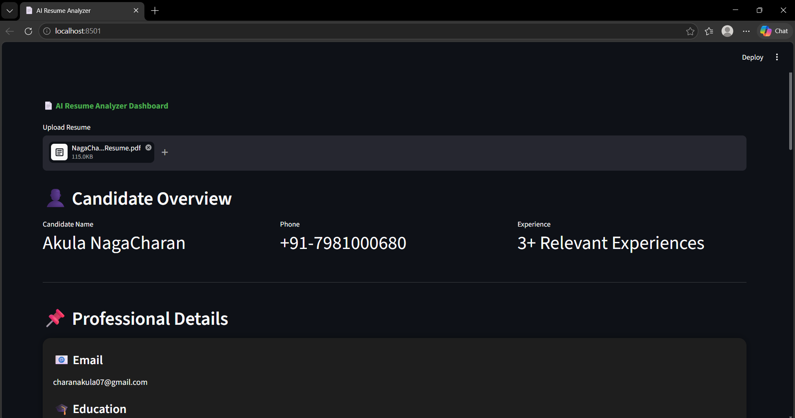
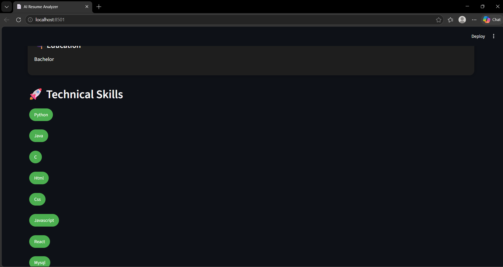
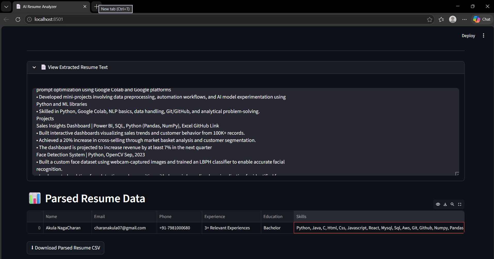

# AI Resume Analyzer Dashboard

An advanced AI-powered Resume Parser and Resume Analysis Dashboard built using Python and Streamlit.

---

## Features

- Resume Parsing from PDF and DOCX
- Extracts:
  - Name
  - Email
  - Phone Number
  - Skills
  - Education
  - Experience
- Professional Dashboard UI
- Real-time Resume Analysis
- Skills Detection
- Clean Data Table Visualization

---

## Technologies Used

- Python
- Streamlit
- NLP
- Pyresparser
- PDFPlumber
- Pandas

---

# Dashboard Preview

## Main Dashboard


## Resume Extraction


## Skills Analysis


---

## Installation

```bash
git clone https://github.com/charanakula07-ui/AI-Resume-Parser.git

cd AI-Resume-Parser

pip install -r requirements.txt

streamlit run app.py
